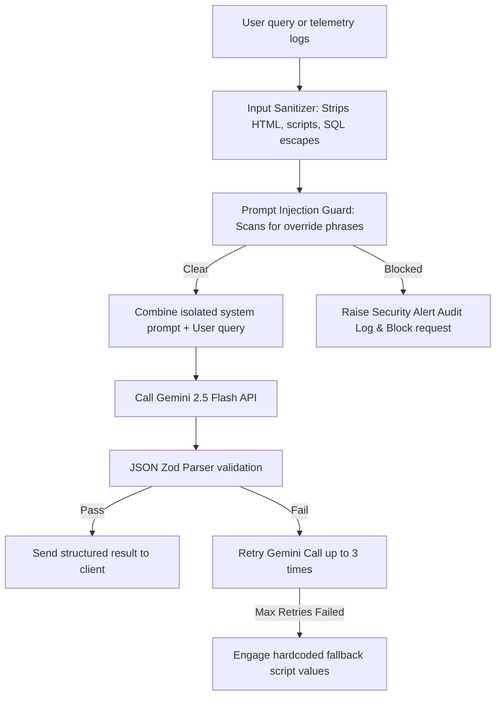

# Generative AI Architecture - StadiumMind AI

StadiumMind AI uses **Google Gemini 2.5 Flash** as its primary cognitive agent. Rather than simple text prompts, the platform integrates AI deeply into system workflows.

---

## AI Execution Safety Pipeline

To protect the platform against prompt injections, leakage, and hallucinations, every AI prompt traverses a robust multi-stage gateway before hitting client interfaces:

---

## prompt Structures & System Templates

System instructions are isolated from user inputs inside `backend/src/services/ai/aiService.ts`.

### 1. Universal Fan Assistant Prompt
Answers venue inquiries in 6 supported languages:
- **System instruction**: Sets identity as "StadiumMind AI Companion", enforces target schema (Zod schema checking for `detectedLanguage` and translated `answer`).
- **Inputs**: User text queries.

### 2. Smart Navigation Explainer Prompt
Narrates graph navigation results based on mode constraints:
- **System instruction**: Sets identity as navigation assistant, tailors instructions dynamically (e.g. emphasize elevator ramps for wheelchairs).
- **Inputs**: Sequenced node strings, current navigation mode parameters.

### 3. Crisis Response Coordinator Prompt
Fires emergency strategic responses:
- **System instruction**: Evaluates the category of event (Fire, Stampede, Medical), returns a structured JSON evac path recommendation, volunteer assignments, and script for stadium speakers.
- **Inputs**: Incident category, severity indicators, zone metrics, description.
