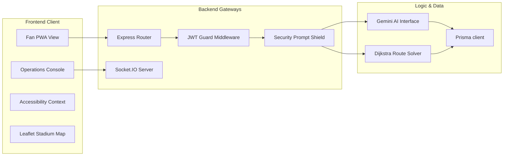
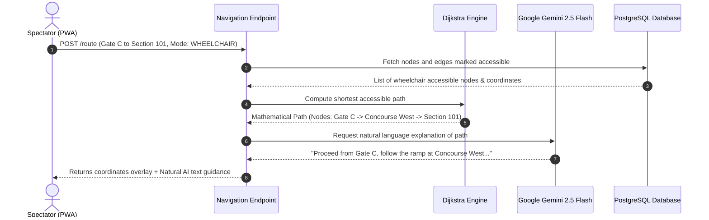

# System Architecture - StadiumMind AI

This document provides a technical walkthrough of the architecture of StadiumMind AI.

## Component Block Diagram

The project uses clean, modular service boundaries following a Clean Architecture pattern on the backend and components separation on the frontend:



---

## Entity-Relationship (ER) Database Schema

The database is built on PostgreSQL. Below is the relational entity model:

```mermaid
erDiagram
    User {
        string id PK
        string email UNIQUE
        string passwordHash
        string name
        enum role
    }
    Session {
        string id PK
        string userId FK
        string refreshToken
        datetime expiresAt
    }
    VolunteerInfo {
        string id PK
        string userId FK
        string status
        string currentZone
        string specialties
    }
    CrowdZone {
        string id PK
        string zoneName UNIQUE
        float currentDensity
        int queueLength
        int occupancyCount
        string status
    }
    RouteNode {
        string id PK
        string name UNIQUE
        float latitude
        float longitude
        boolean isAccessible
    }
    RouteEdge {
        string id PK
        string fromNode
        string toNode
        float distance
        float weightModifier
        boolean isAccessible
    }
    Incident {
        string id PK
        string type
        string severity
        string status
        string zone
        string description
        string aiSummary
        json aiResponse
    }
    AIConversation {
        string id PK
        string userId FK
        string language
    }
    AIMessage {
        string id PK
        string conversationId FK
        string role
        string content
    }

    User ||--o{ Session : "has"
    User ||--o| VolunteerInfo : "details"
    User ||--o{ AIConversation : "starts"
    AIConversation ||--o{ AIMessage : "contains"
    RouteNode ||--o{ RouteEdge : "defines"
```

---

## Technical Routing Operations Flow (Sequence Diagram)

This sequence diagram details the process when a fan requests dynamic navigation routes in wheelchair-accessible mode:


