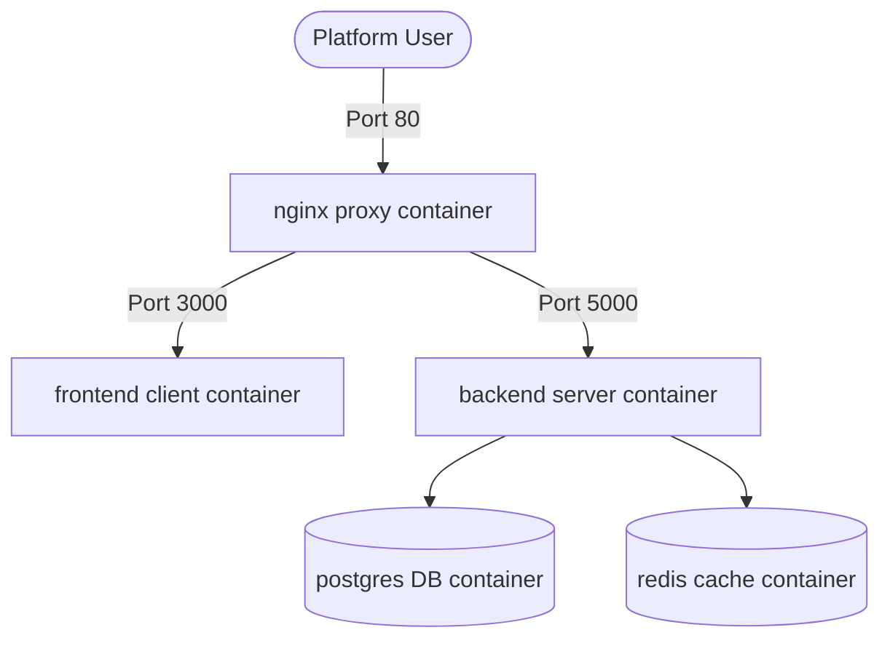

# Deployment & Orchestration Guide - StadiumMind AI

StadiumMind AI is fully containerized using multi-stage production Docker configurations to maximize build caching, minimize image sizing, and enhance runtime security.

## Production Stack Layout

The platform uses five core containers managed by `docker-compose.yml`:

---

## Port Mappings & Services

| Container | Internal Port | External Port | Volumes / Mounts | Purpose |
|:---|:---|:---|:---|:---|
| **nginx** | 80 | **80** | `./nginx/nginx.conf` | Reverse proxy and SSL termination endpoint. |
| **frontend** | 3000 | **3000** | None | Next.js client engine hosting. |
| **backend** | 5000 | **5000** | None | Node.js Express & Socket.IO APIs. |
| **db** | 5432 | **5432** | `pgdata` | PostgreSQL database storing logs and telemetry. |
| **redis** | 6379 | **6379** | `redisdata` | Redis instance for session state caching. |

---

## Production Deployment Checklist

1. Make sure all secrets (e.g. `JWT_ACCESS_SECRET`, `JWT_REFRESH_SECRET`) are changed from default values in the environment configurations.
2. Provide a valid `GEMINI_API_KEY` to allow live operations and assistant support.
3. Keep database ports unexposed to external internet addresses. Only allow access via nginx.
4. Scale frontend nodes depending on game spectator loads.
