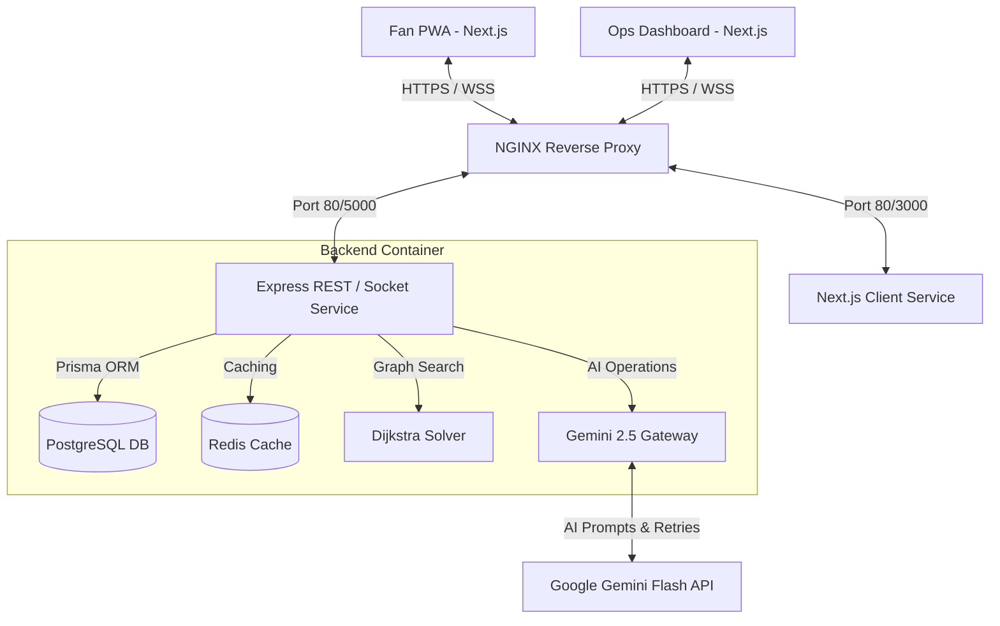

# StadiumMind AI - Smart Stadium Operations & Fan PWA Platform

StadiumMind AI is an enterprise-grade, production-ready smart stadium management and multilingual spectator engagement platform designed for the **FIFA World Cup 2026**. 

The platform leverages Generative AI (using Google Gemini 2.5 Flash), graph algorithms (Dijkstra's routing solver), and real-time WebSockets to manage crowd telemetry, dynamic evacuation paths, multilingual fan assistance, carbon audits, and accessible pathfinding.

---

## Challenge Alignment & AI Justification

| Challenge Goal | Platform Implementation | AI Justification (Why Generative AI?) |
|:---|:---|:---|
| **Navigation** | Graph solver navigation engine with natural language explanation | Traditional GPS maps do not handle custom venue paths. Generative AI explains coordinates step-by-step, focusing on context (e.g. ramps for wheelchairs). |
| **Crowd Management** | Telemetry dashboard with AI Operations Briefing | Aggregating data from multiple zones is complex. Gemini synthesizes dense numbers into a friendly paragraph of priorities. |
| **Accessibility** | Persistent WCAG AA, voice assist features, audio guides | Translates graph nodes to speech transcripts and reads them dynamically via local Web Speech Synthesis. |
| **Transportation** | Live dynamic transit schedules and routes | Dynamically recalculates exit gates and explains optimal taxi/metro rides based on congestions. |
| **Sustainability** | Carbon tracking and utility audits | Generative AI parses utility telemetry logs to draft energy efficiency audits and clean recommendations. |
| **Multilingual Assist** | Fan assistant support in 6 languages | Automatically detects user query language (EN, ES, FR, PT, AR, HI) and provides fluid answers without static translation lists. |
| **Decision Support** | Incident feeds with AI-assisted emergency responses | Gemini immediately suggests volunteer deployment instructions, public announcements, and evacuations during emergencies. |

---

## Technical Stack

- **Frontend**: Next.js 15, React 19, TypeScript, Tailwind CSS, Leaflet with OpenStreetMap, Socket.IO Client.
- **Backend**: Node.js, Express, TypeScript, Socket.IO, Redis.
- **Database**: PostgreSQL, Prisma ORM.
- **AI Integration**: Google Gemini 2.5 Flash API.
- **Security**: JWT Rotation, Helmet, Rate Limiter, Prompt Injection Shield, SQL/HTML Sanitizers.
- **Deployment**: Docker, Docker Compose, NGINX Reverse Proxy.

---

## System Architecture



---

## Local Setup & Installation

### Prerequisites
- Node.js version 20+
- Docker & Docker Compose
- A Google Gemini API Key (obtainable via Google AI Studio)

### Step 1: Clone and Set Up Environments
1. Copy the example environment variables:
   ```bash
   cp .env.example .env
   ```
2. Open `.env` and fill in your details:
   - Make sure to update `GEMINI_API_KEY` with your actual Google AI Studio API key.

### Step 2: Running with Docker Compose (Recommended)
Compile, run, and launch the complete stadium application suite (Postgres, Redis, Backend, Frontend, NGINX) in one command:
```bash
docker-compose up --build
```
Once healthy, access the interfaces at:
- **Platform Access (Via NGINX)**: [http://localhost](http://localhost)
- **Fan Companion PWA Direct**: [http://localhost:3000](http://localhost:3000)
- **Operations Dashboard Direct**: [http://localhost:3000/dashboard](http://localhost:3000/dashboard) (requires logging in as an OPERATOR)
- **Backend API Server**: [http://localhost:5000](http://localhost:5000)

### Step 3: Local Development (Manual Boot)
1. **Start database containers**:
   ```bash
   docker-compose up db redis -d
   ```
2. **Install and Seed Backend**:
   ```bash
   cd backend
   npm install
   npx prisma db push
   npm run prisma:seed
   npm run dev
   ```
3. **Install and Run Frontend**:
   ```bash
   cd ../frontend
   npm install
   npm run dev
   ```

---

## Running Test Suites

Validate code coverage and correctness with local test scripts:

### Backend Tests (Jest)
Runs unit test layers for the Graph routing calculations and sanitizers:
```bash
cd backend
npm run test
```

---

## Documentation Index

Detailed architectural descriptions are stored inside:
- [System & Component Design](file:///d:/FIFIA%20PROJECT/Architecture.md)
- [Generative AI Design & Prompts](file:///d:/FIFIA%20PROJECT/AI-Architecture.md)
- [Security Shield details](file:///d:/FIFIA%20PROJECT/Security.md)
- [REST API Specification](file:///d:/FIFIA%20PROJECT/API.md)
- [Deployment & Orchestration](file:///d:/FIFIA%20PROJECT/Deployment.md)
